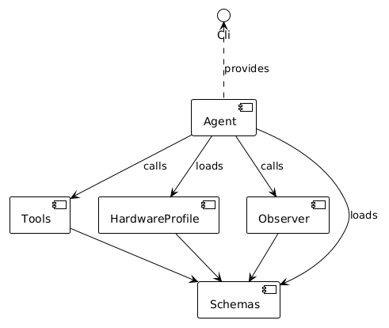
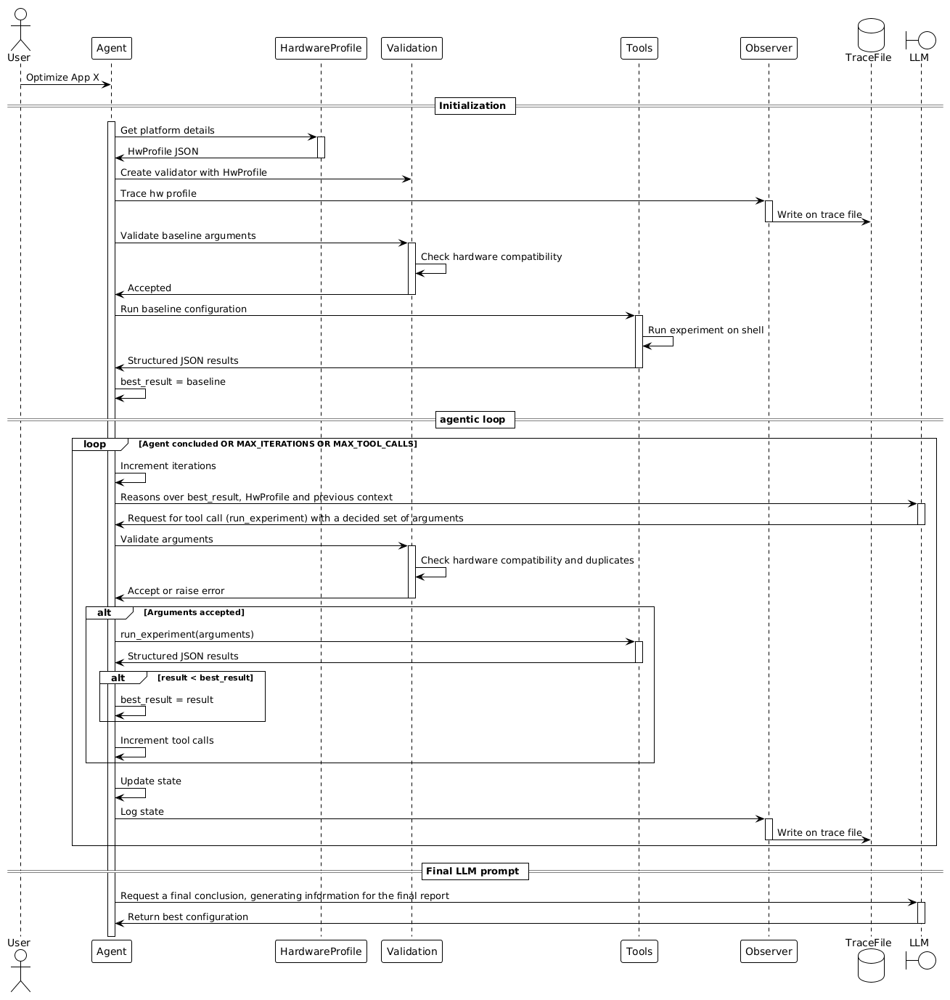

# agentic-hpc

agentic-hpc is a platform-aware agentic system that reasons towards the available resources and finds the best configuration to run a specific workload. By using platform specific information (e.g.,, core count,  SMT capabilities, cache memory size), the agent can make decisions based on grounding data instead of performing exhaustive or heuristic searches.

## Architecture

agentic-hpc is split in components that can be adapted to different goals (e.g., max performance, lower energy consumption, etc).

### Components

- **Agent**: Core orchestrator that manages state, runs the LLM loop, and calls tools.
- **Tools**: Collection of callable functions (e.g., `run_experiment`) exposed to the LLM.
- **HardwareProfile**: Gathers platform information from `/sys/devices/system/cpu` and presents a JSON‑serialisable dict.
- **Observer**: Records all state changes and writes a trace file in `traces/`.
- **Schemas**: Pydantic and dataclass models for state, events, tool arguments and results.

<!--
@startuml
!theme mono
component Agent as ag
component Tools as tl
component HardwareProfile as hwp
component Observer as obs
component Schemas as sc
interface Cli

Cli <.. ag: provides
ag -> tl: calls
ag -> hwp: loads
ag -> obs: calls
ag -> sc: loads

tl -> sc
hwp -> sc
obs -> sc


@enduml
-->


The diagram displays the interactions between the Agent, Tools, HardwareProfile, Observer and Schemas components, highlighting data flow and dependencies.

### Agentic flow

<!-- @startuml

!theme mono


Actor User as us
Participant Agent as ag
Participant HardwareProfile as hwp
Participant Tools as tl
Participant Observer as obs
Database TraceFile as trace
Boundary LLM as llm

us -> ag: Optimize App X
== Initialization ==
activate ag
ag -> hwp: Get platform details
activate hwp
hwp -> ag: HwProfile JSON
deactivate hwp
ag -> obs: Trace hw profile
activate obs
obs -> trace: Write on trace file
deactivate obs
ag -> tl: Run baseline configuration
activate tl
tl -> tl: Run experiment on shell
tl -> ag: Structured JSON results
deactivate tl
ag -> ag: best_result = baseline
== agentic loop ==
loop Agent concluded OR MAX_ITERATIONS OR MAX_TOOL_CALLS
  ag -> llm: Reasons over best_result, HwProfile and previous context
  activate llm
  llm -> ag: Request for tool call (run_experiment) with a decided set of arguments
  deactivate llm
  ag -> tl: run_experiment(arguments)
  activate tl
  tl -> ag: Structured JSON results
  deactivate tl
  alt result < best_result
    ag -> ag: best_result = result
  end
  ag -> ag: Increment iterations and tool calls
  ag -> ag: Update state
  ag -> obs: Log state
  activate obs
  obs -> trace: Write on trace file
  deactivate obs
end
== Final LLM prompt ==
ag -> llm: Request a final conclusion, generating information for the final report
activate llm
llm -> ag: Return best configuration
deactivate llm

@enduml -->



The diagram illustrates the LLM‑driven agent loop: initialization, baseline run, iterative reasoning, tool calls, and final report generation.

## How to run

### Setup a docker container image

Create a Dockerfile, for example

```
FROM ubuntu:26.04
# RUN # Install any tools that might be needed for running your benchmarks
COPY benchmarks/ ./benchmarks/ # Copy your benchmarks to the image
# RUN # Run any commands needed to setup your benchmarks, for instance, if you need to compile them
```

Generate the image by running the following in the same folder your Dockerfile resides

```
docker build -t my_docker_image_name .
```

### Run the agent

```
python3 src/agentic_hpc/main.py --benchmark-path <benchmark_path>/<benchmark_name> --docker-image my_docker_image_name
```

The script expects an OpenAI server running at http://localhost:8080/v1. It is recommended to use a LLM with high reasoning capabilities.

## Analyze the result

The last output from the agent will provide a markdown formatted conclusion of the entire process. For more details on each iteration, check the latest trace file in the created `traces/trace_<timestamp>` directory.
You can also request an LLM to provide you a report based on the trace file.

### Examples of final reports

You can see examples of final reports generated based on a trace in the [doc/](doc/reports) directory. These were executed with the following environment:

|Component|Description|
|--|--|
|CPU| AMD Ryzen 7 5700X3D (8 cores, 16 threads) @ 4.15 GHz|
|Memory|32GB DDR4|
|GPU|AMD Radeon RX 9070 XT [Discrete] - 16GB VRAM|
|Host|Linux 7.2.3-1-cachyos|
|Docker Image|ubuntu:26.04|
|LLM|unsloth/Qwen3.8-27B-GGUF:UD-Q3_K_XL - xhigh reasoning - running locally|
|Applications|Class B EP and CG benchmarks from [NAS Parallel benchmarks](https://www.nas.nasa.gov/software/npb.html)|

#### A note on the results

The NAS Parallel benchmarks are well known applications with several published articles explaining their characteristics and profiles. There is a high probability that any LLM model can identify those benchmarks and therefore easily figure out the best configuration to run them. In fact, this can be seen in the reports as part of the reasoning of the agent. 

Examples:
```
EP is compute-bound and embarrassingly parallel (integer RNG generation + floating-point Gaussian pair computation). It should scale near-linearly across the 8 physical cores.
```

```
CG is memory-bandwidth-bound (spmv), so it should scale well across cores, but SMT siblings would add cache/bandwidth contention.
```

This does not exclude the necessity of reasoning from the agent itself, as it needs to understand the constrains of the application and adapt to the current running platform. A completely unknown application might take more iterations to find the best configuration, and extra hardware counters (CPU usage, cache misses, etc) might become essential for correct reasoning.